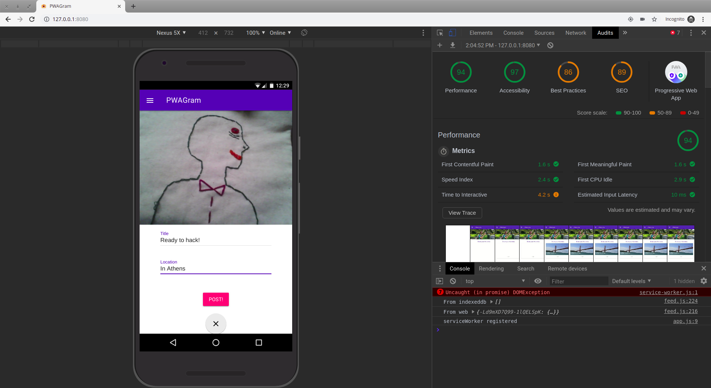

## Work from Udemy course "Progressive Web Apps (PWA) - The Complete Guide"

#### This repository hosts all my work completed while taking this udemy course: https://www.udemy.com/course/progressive-web-app-pwa-the-complete-guide/. 

#### Throughout the course you learn how to:

* Build web apps that look and feel like native mobile apps for iOS and Android
* Leverage device features like the camera and geolocation in your web apps
* Use service workers to build web apps that work without internet connection (offline-first)
* Use web push notifications to increase user engagement with your web apps
* Use advanced service worker usage and caching strategies
* Synchronize data in the background, even if connection is lost
* Turn your next SPA project into a PWA

#### It's a great course and I highly recommend it!

#### Below are some screenshots of the application you build throughout the course

##### Being prompted to add the app to your home screen, triggered by a button click.

##### Subscribing to notifications

##### Receiving a notification for a new post

##### Retrieving items from IndexedDB when there is no internet connection, ensuring the application still works perfectly even when on the subway!

##### The Lighthouse score turned out pretty good. This screen also shows the app making use of the device's built in camera.

